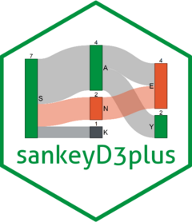

# sankeyD3plus 

The R package **{sankeyD3plus}** lets you create ['D3' 'JavaScript'](https://d3js.org/) [Sankey diagrams](https://en.wikipedia.org/wiki/Sankey%20diagram) in R. 

This package is heavily based on [this fork](https://github.com/fbreitwieser/sankeyD3/pull/21) from [{sankeyD3}](https://github.com/fbreitwieser/sankeyD3), which in turn is based on [{networkD3}](https://github.com/christophergandrud/networkD3) and [d3-sankey](https://github.com/d3/d3-sankey). I decided to create {sankeyD3plus} because 

 1. {sankeyD3} has not been maintained for years and the author does not seem to respond to issues
 2. the mentioned fork added a significant improvement 
 3. I wanted to add helper functions 
 4. I wanted to add more examples in the documentation

## Installation

You can install `sankeyD3plus` like so:

``` r
remotes::install_github('SchmidtPaul/sankeyD3plus')
```

## Examples

Check out the [Examples page](https://schmidtpaul.github.io/sankeyD3plus/articles/Examples.html)!
